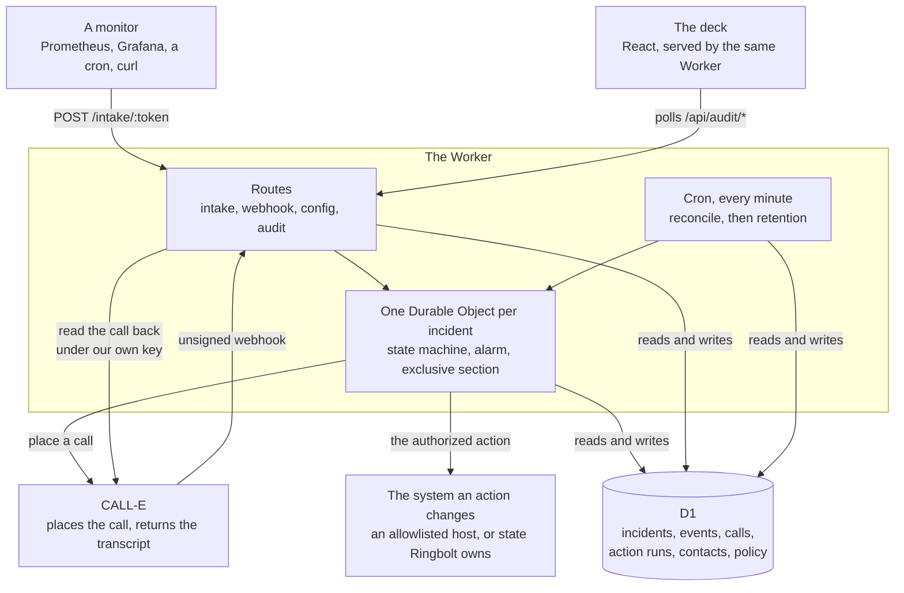
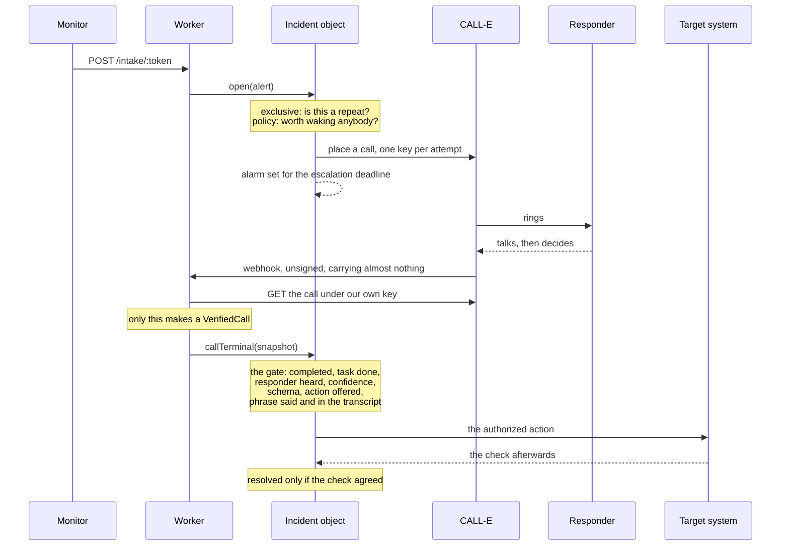

# How Ringbolt is put together

Four moving parts and two rules. The rules are the reason for most of the shape, so they come first.

**A webhook cannot authorize anything.** CALL-E delivers its terminal events unsigned. So a delivery
is used for exactly two things, to learn which call to go and read and to deduplicate retries, and
the call itself is fetched back under our own key before any of it is believed.

**Nothing decides twice about one incident.** Every incident is owned by one Durable Object, and
every read-then-write about it happens inside that object's exclusive section. Two deliveries
arriving together about one incident would otherwise both read the state before either wrote it, and
both act on it: two telephone calls to a real person, or one production change applied twice.

## The parts

The dashboard polls rather than holding a socket. The deck is an aggregate across every incident and
each incident is owned by its own object, so a socket would mean a second object that every incident
reports into: new state on the path that decides whether a telephone rings, added for a screen.

## One incident, end to end

If the webhook never arrives, the alarm fires at the escalation deadline and reads the call back
itself, which runs the identical code the webhook path would have run. If the alarm was lost with
the isolate that set it, the cron sweep finds the incident and calls the same code again. Recovery
and ordinary operation are one path, deliberately: two paths drift, and the one that drifts is the
one nobody exercises.

## Where the boundaries are

| Boundary                                         | What enforces it                                                                                                                              |
| ------------------------------------------------ | --------------------------------------------------------------------------------------------------------------------------------------------- |
| A decision must come from a call we fetched      | The type system. The gate takes a `VerifiedCall` and only `verifyCall` makes one                                                              |
| One open incident per fingerprint                | A unique index in migration 0004, not a check in code                                                                                         |
| Nothing decides twice about one incident         | `blockConcurrencyWhile` in the incident's Durable Object                                                                                      |
| The browser bundle cannot reach server code      | `src/ui` may import `src/domain/view.ts` and nothing else under `src`, enforced by dependency-cruiser, and that module imports nothing at all |
| An action can only reach named hosts             | `ACTION_HOST_ALLOWLIST`, deployment configuration rather than a row                                                                           |
| A live build can only dial named numbers         | `LIVE_CALL_ALLOWLIST`, the same argument                                                                                                      |
| An action's credentials cannot be the CALL-E key | Only a binding named `RUNBOOK_SECRET_*` can be read                                                                                           |
| A public demo cannot ring a telephone            | `DEMO_MODE` with `CALLE_MODE=live` is a configuration error and the deployment serves nothing                                                 |
| One deployment is one tenant                     | `adr/0002-tenancy.md`. There is no tenant column because there is no second tenant                                                            |

## Why a Durable Object rather than a table and a sweep

Escalation is the feature. If the person on call does not answer within the service's window, the
next person has to be telephoned, and that is a per-incident timer that has to survive a restart and
fire at a specific moment. A row with a `due_at` column and a cron sweeping it turns "escalate after
forty five seconds" into "escalate some time in the next minute or two", on a product whose whole
pitch is what happens in the first minute of an incident.

The object also gives the exclusive section for free, which is the other half of why it is there.
`adr/0001-stack.md` has the options that were weighed against it.
